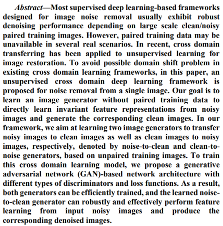
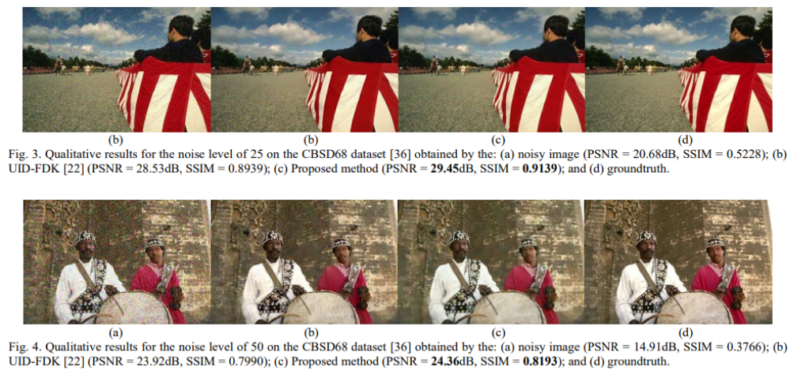

# Unsupervised-Cross-Domain-Learning-for-Noise-Removal-from-a-Single-Image
This repository provides the official PyTorch implementation of the following paper:
>**Unsupervised-Cross-Domain-Learning-for-Noise-Removal-from-a-Single-Image**


<p align="center">
    
</p>

<p align="center">
    
</p>

## Requirements
To install requirements:

```setup
conda env create -n [your env name] -f environment.yaml
conda activate [your env name]
```

## To train the model
### Synthetic Noise (AWGN)
1. Download DIV2K dataset for training in [here](https://data.vision.ee.ethz.ch/cvl/DIV2K/)
2. Randomly split the DIV2K dataset into Clean/Noisy set. Please refer the .txt files in `split_data`.
3. Place the splitted dataset(DIV2K_C and DIV2K_N) in `./dataset` directory.
```
dataset
└─── DIV2K_C
└─── DIV2K_N
└─── test
```
4. Use `gen_dataset_synthetic.py` to package dataset in the h5py format.
5. After that, run this command:
```
sh ./scripts/train_awgn_sigma15.sh # AWGN with a noise level = 15
sh ./scripts/train_awgn_sigma25.sh # AWGN with a noise level = 25
sh ./scripts/train_awgn_sigma50.sh # AWGN with a noise level = 50
```
6. After finishing the training, `.pth` file is stored in `./exp/[exp_name]/[seed_number]/saved_models/` directory. 

###  Real-World Noise
1. Download SIDD-Medium Dataset for training in [here](https://www.eecs.yorku.ca/~kamel/sidd/dataset.php)
2. Radnomly split the SIDD-Medium Dataset into Clean/Noisy set. Please refer the .txt files in `split_data`.
3. Place the splitted dataset(SIDD_C and SIDD_N) in `./dataset` directory.
```
dataset
└─── SIDD_C
└─── SIDD_N
└─── test
```
4. Use `gen_dataset_real.py` to package dataset in the h5py format.
5. After that, run this command:
```
sh ./scripts/train_real.sh
```
6. After finishing the training, `.pth` file is stored in `./exp/[exp_name]/[seed_number]/saved_models/` directory.

###  LDCT Noise

```
dataset
└─── LDCT_C
└─── LDCT_N
└─── test
```
1. Use `gen_dataset_real.py` to package dataset in the h5py format.
2. After that, run this command:
```
sh ./scripts/train_ldct.sh
```
## To evaluate the model
### Synthetic Noise (AWGN)
1. Download CBSD68 dataset for evaluation in [here](https://drive.google.com/drive/folders/1lNet_6YH-sAG3nkR1zb2EKSiFmek7ywQ?usp=sharing)
2. Place the dataset in `./dataset/test` directory.
```
dataset
└─── train
└─── test
     └─── CBSD68
     └─── SIDD_test
     └─── LDCT_test
```
3. After that, run this command:
```
sh ./scripts/test_awgn_sigma15.sh # AWGN with a noise level = 15
sh ./scripts/test_awgn_sigma25.sh # AWGN with a noise level = 25
sh ./scripts/test_awgn_sigma50.sh # AWGN with a noise level = 50
```

### Real-World Noise
1. Download the SIDD test dataset for evaluation in [here](https://drive.google.com/drive/folders/1lNet_6YH-sAG3nkR1zb2EKSiFmek7ywQ?usp=sharing)
2. Place the dataset in `./dataset/test` directory.
```
dataset
└─── train
└─── test
     └─── CBSD68
     └─── SIDD_test
     └─── LDCT_test
```
3. After that, run this command:
```
sh ./scripts/test_real.sh
```

### LDCT Noise
1. Download the LDCT test dataset for evaluation in [here](https://drive.google.com/drive/folders/1uMoTq3bZxGcfdxITOjwpekLYX8BLijfX?usp=drive_link)
2. Place the dataset in `./dataset/test` directory.
```
dataset
└─── train
└─── test
     └─── CBSD68
     └─── SIDD_test
     └─── LDCT_test
```
3. After that, run this command:
```
sh ./scripts/test_ldct.sh
```


## Pre-trained model
We provide pre-trained models in `./checkpoints` directory.
```
checkpoints
|   best_sigma15.pth # pre-trained model (AWGN with a noise level = 15)
|   best_sigma25.pth # pre-trained model (AWGN with a noise level = 25)
|   best_sigma50.pth # pre-trained model (AWGN with a noise level = 50)
|   best_SIDD.pth # pre-trained model (Real-World noise)
|   best_LDCT.pth # pre-trained model (LDCT noise)
```

## Acknowledgements
This code is built on [UID-FDK](https://github.com/jdg900/UID-FDK),[U-GAT-IT](https://github.com/znxlwm/UGATIT-pytorch),[CARN](https://github.com/nmhkahn/CARN-pytorch), [SSD-GAN](https://github.com/cyq373/SSD-GAN). We thank the authors for sharing their codes.


## Contact
If you have any questions, feel free to contact me
